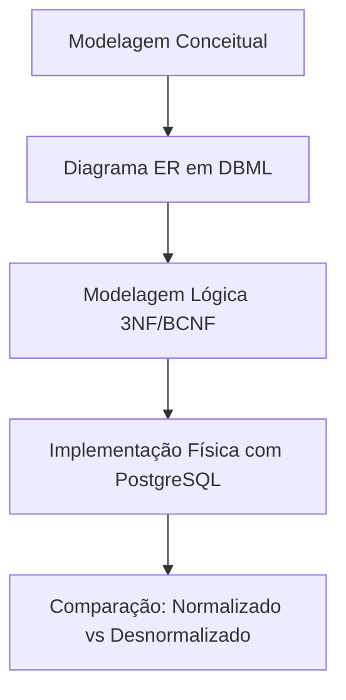
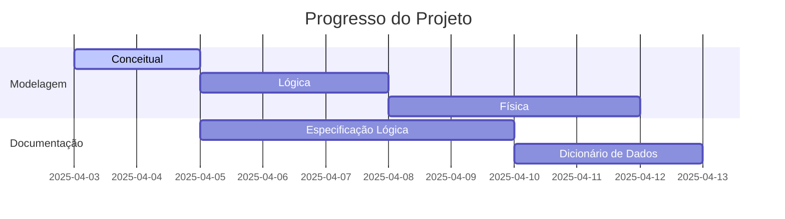

# 🛒 Sistema OLTP para E-Commerce

## 📖 Visão Geral
Projeto demonstrando um pipeline completo de modelagem de dados OLTP para e-commerce, desde a concepção até a implementação com governança. Destaques:

- **Processo trifásico de modelagem**: Conceitual → Lógica → Física
- **Governança prática**: RLS, auditoria, monitoramento em tempo real
- **Documentação corporativa**: Dicionário de dados, histórico de decisões, comparação de abordagens

## 🎯 Diferenciais Técnicos

## 📂 Estrutura do Projeto
```plaintext
ecommerce_oltp/
├── 📁 docs/                      # Documentação detalhada
│   ├── visao.md                  # Documento de visão do projeto
│   ├── backlog.md                # Backlog priorizado
│   ├── diagrama_er.png           # Diagrama ER (imagem)
│   ├── decisoes_tecnicas.md      # Registro de escolhas técnicas
│   ├── dicionario_dados.md       # Dicionário de dados
│   ├── modelagem_logica.md       # Especificação da modelagem lógica
│   ├── comparacao_modelos.md     # Análise normalizado vs desnormalizado
├── 📁 infra/                     # Configuração Docker
│   ├── docker-compose.yml        # Arquivo de configuração do Docker Compose
│   └── Dockerfile                # Dockerfile para o ambiente
├── 📁 scripts/                   # Scripts SQL e Python
│   ├── gerador_dados.py          # Gerador de dados sintéticos
│   └── sql/                      # Scripts SQL
│       ├── 01_esquema.sql        # Criação do esquema do banco
│       ├── 02_indices.sql        # Criação de índices
│       ├── 03_dados_teste.sql    # Inserção de dados de teste
│       ├── 01a_modelo_normalizado.sql # Esquema normalizado
│       ├── 01b_modelo_desnormalizado.sql # Versão alternativa
├── 📁 monitoramento/             # Configuração de monitoramento
│   ├── dashboard_grafana.json    # Dashboard do Grafana
│   └── queries_monitoramento.sql # Queries para monitoramento
├── [CHANGELOG.md]                # Histórico de mudanças
├── LICENSE                       # Licença do projeto
└── [README.md]                   # Documentação principal
```

## 📌 Documentação Completa
- **Visão do Projeto**: [docs/visao.md](docs/visao.md)
- **Backlog**: [docs/backlog.md](docs/backlog.md)
- **Decisões Técnicas**: [docs/decisoes_tecnicas.md](docs/decisoes_tecnicas.md)
- **Histórico de Versões**: [CHANGELOG.md](CHANGELOG.md)

## 🚀 Status Atual
- **Planejamento**: Concluído ✅
- **Modelagem de Dados**: Em andamento 🚧
  - Definição de entidades principais.
  - Estabelecimento de relacionamentos.
  - Criação do diagrama ER.



## 🛠️ Tecnologias
- **PostgreSQL**: Banco de dados relacional.
- **Docker**: Para configuração e execução do ambiente.
- **DBML**: Para versionamento de diagramas ER.
- **EXPLAIN ANALYZE**: Para análise de performance de queries SQL.
- **Grafana**: Dashboards para:
  - Monitoramento de transações.
  - Eficiência de índices.
  - Comparação entre modelos normalizado e desnormalizado.

## 🔍 Métricas de Qualidade
| Área         | Critério de Sucesso               |
| ------------ | --------------------------------- |
| Modelagem    | 100% rastreabilidade entre níveis |
| Performance  | 95% queries < 200ms em carga real |
| Documentação | 10+ trade-offs justificados       |

## 🧑‍💻 Como Contribuir
1. Faça um fork do repositório.
2. Crie uma branch para sua feature:
   ```bash
   git checkout -b minha-feature
   ```
3. Faça um commit:
   ```bash
   git commit -m "feat: minha nova feature"
   ```
4. Envie para o repositório remoto:
   ```bash
   git push origin minha-feature
   ```
5. Abra um Pull Request.

## 📝 Licença
Este projeto está licenciado sob a Licença MIT. Consulte o arquivo [LICENSE](LICENSE) para mais detalhes.

