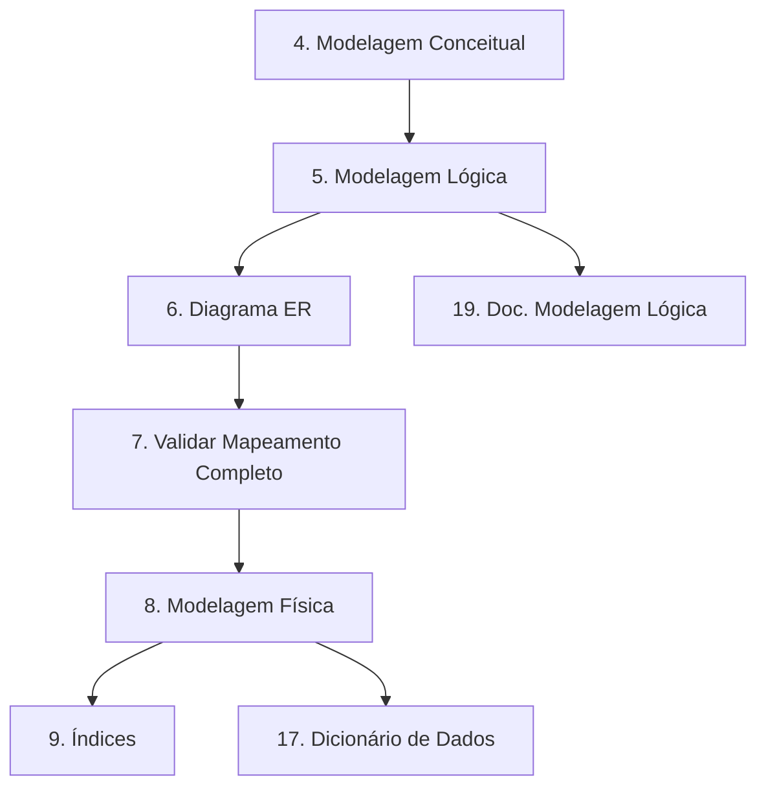

## (EPIC) Planejamento
1. [x] Criar o documento de visão do projeto (`docs/visao.md`).
2. [x] Definir o escopo e o não escopo do projeto.
3. [x] Criar o roadmap visual no formato `mermaid`.

## (EPIC) Modelagem de Dados
4. [ ] Definir entidades principais e relacionamentos (Modelagem Conceitual).
    - [ ] Identificar entidades-chave (usuários, produtos, pedidos, pagamentos).
    - [ ] Mapear cardinalidades (1:1, 1:N, N:M).
5. [ ] Desenvolver Modelagem Lógica.
    - [ ] Converter entidades para tabelas com atributos.
    - [ ] Definir tipos de dados preliminares.
    - [ ] Normalizar para 3NF/BCNF.
    - [ ] Documentar trade-offs no arquivo (`docs/decisoes_tecnicas.md`).

### Tarefa 5 - Modelagem Lógica
Critérios:
- Todas as entidades mapeadas na conceitual estão presentes.
- Atributos com tipos de dados preliminares consistentes.
- Documentados pelo menos 3 trade-offs de normalização.

6. [ ] Criar diagrama ER lógico (`docs/diagrama_er.dbml`).
7. [ ] Validar mapeamento completo (conceitual → lógica → física).
8. [ ] Desenvolver Modelagem Física.
    - [ ] Implementar esquema no PostgreSQL (`scripts/sql/01_esquema.sql`).
    - [ ] Definir tipos de dados reais (ex.: `VARCHAR(255)` → `TEXT` com constraints).
    - [ ] Adicionar partitioning (se necessário).
    - [ ] Criar sequences para PKs auto-incremento.
    - [ ] Gerar script DDL completo (`scripts/sql/01_esquema.sql`).
    - [ ] Documentar alterações físicas em relação à lógica (`docs/decisoes_tecnicas.md`).
9. [ ] Adicionar índices otimizados para consultas frequentes (`scripts/sql/02_indices.sql`).

## (EPIC) Governança
10. [ ] Configurar roles e permissões no PostgreSQL.
11. [ ] Implementar Row-Level Security (RLS) para dados sensíveis.
12. [ ] Criar triggers para auditoria básica (log de alterações).

## (EPIC) Monitoramento
13. [ ] Configurar painel no Grafana para monitorar métricas do PostgreSQL.
14. [ ] Criar queries de monitoramento (`monitoramento/queries_monitoramento.sql`).
    - [ ] Consultar transações por minuto.
    - [ ] Identificar deadlocks.
    - [ ] Monitorar uso de índices.
15. [ ] Testar o monitoramento com dados sintéticos.

## (EPIC) Documentação
16. [x] Criar o README inicial do projeto.
17. [x] Adicionar licença ao projeto (`LICENSE`).
18. [ ] Criar o dicionário de dados (`docs/dicionario_dados.md`).
19. [ ] Registrar decisões técnicas no arquivo (`docs/decisoes_tecnicas.md`).
20. [ ] Criar o arquivo de modelagem lógica (`docs/modelagem_logica.md`).
21. [ ] Atualizar o README com links para a documentação.
22. [ ] Comparar modelagem lógica vs física em `docs/decisoes_tecnicas.md`.

## (EPIC) Dados de Teste
23. [ ] Criar script Python para gerar dados sintéticos (`scripts/gerador_dados.py`).
24. [ ] Popular o banco com dados de teste (`scripts/sql/03_dados_teste.sql`) (depende da tarefa 23).

## (EPIC) Refinamento
25. [ ] Adicionar versão desnormalizada para comparação de performance.
26. [ ] Revisar e otimizar queries com `EXPLAIN ANALYZE`.
    - [ ] Garantir que 95% das queries tenham tempo de execução < 200ms.
27. [ ] Atualizar o `CHANGELOG.md` com as mudanças realizadas.

---

## Prioridades
- **Alta**: Planejamento, Modelagem de Dados, Governança.
- **Média**: Monitoramento, Documentação.
- **Baixa**: Dados de Teste, Refinamento.
