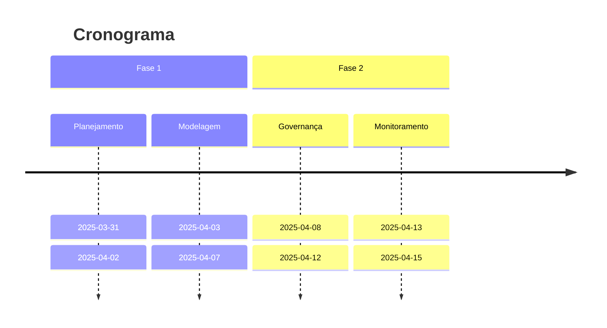

# Visão do Projeto

## 🔎 Problema
Falta de exemplos práticos que integrem:
- Modelagem OLTP **com trade-offs reais** (normalização vs performance)
- Governança **aplicável** (RLS, auditoria, backups)
- Documentação **no padrão corporativo** (dicionário de dados, histórico de decisões)

## 🛠️ Solução
Sistema de e-commerce com:

1. **Modelagem Profissional**
   - Processo completo: Conceitual → Lógica → Física
   - 3NF/BCNF + comparação com modelo desnormalizado
   - Diagrama ER em DBML (suporte a versionamento)
   - Índices otimizados (EXPLAIN ANALYZE)

2. **Governança Prática**
   - Row-Level Security para dados sensíveis
   - Painel no Grafana (transações/min, deadlocks)

3. **Documentação Replicável**
   - README com decisões técnicas
   - **Três camadas de modelagem** (conceitual, lógica, física)
   - Vídeo de 2 min explicando a arquitetura
   - Dicionário de dados **com comparação lógico-físico**
   - Arquivo de modelagem lógica (`docs/modelagem_logica.md`)

## 🎯 Objetivos Mensuráveis
| Item              | Métrica de Sucesso            |
| ----------------- | ----------------------------- |
| Modelagem         | 5+ entidades relacionadas     |
| **Modelo Lógico** | Documentado com 3+ trade-offs |
| **Modelo Físico** | 100% compatível com o lógico  |
| Performance       | 95% das queries < 200ms       |
| Documentação      | 10+ decisões justificadas     |

## 🚫 NÃO Escopo
- Integração com APIs externas.
- Processos ETL complexos.
- Implementação de front-end.

## 🗺️ Roadmap Visual

## 👥 Público-Alvo
- **Recrutadores**: Prova de habilidades em Modeolagem de dados OLTP e governança
- **Engenheiros(as) de dados Júnior**: Template para estudos
- **Times de Dados**: Exemplo de documentação técnica

## 🛠️ Habilidades Demonstradas
- Modelagem de dados em 3 níveis (conceitual, lógica, física)
- PostgreSQL (modelagem, índices, RLS, partitioning)
- Docker (configuração e persistência)
- Monitoramento com Grafana
- Documentação técnica (dicionário de dados, decisões técnicas)
- Versionamento de diagramas (DBML)